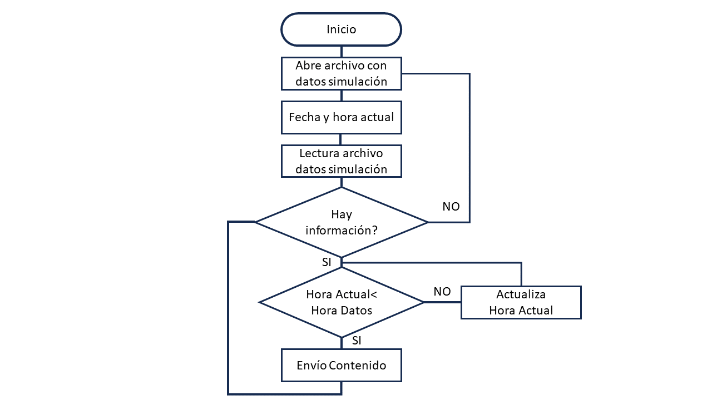

# **Explicación y licencia del código de simulación de consumos y generación**

La licencia del presente programa es GPL v3:

This program is free software: you can redistribute it and/or modify it under the terms of the GNU General Public License as published by the Free Software Foundation, either version 3 of the License, or (at your option) any later version.

This program is distributed in the hope that it will be useful, but WITHOUT ANY WARRANTY; without even the implied warranty of MERCHANTABILITY or FITNESS FOR A PARTICULAR PURPOSE. See the GNU General Public License for more details.

You should have received a copy of the GNU General Public License along with this program. If not, see <https://www.gnu.org/licenses/>.

Una vez indicada la licencia, se procede a la explicación en este texto de las características, del funcionamiento y del código que están recogidos en este repositorio de github: 

[simulador_generacion_consumo](https://github.com/iotlibre/simulador_generacion_consumo)

## **1. Introducción**
El código, programado en Python, permite la simulación de manera estable y robusta de un sistema de generación y consumo eléctricos.

El planteamiento de este código es orientar su uso a comunidades energéticas. Con esto en mente, para conseguir que el funcionamiento del código sea correcto, se debe proceder en el siguiente orden:

1. Conseguir los datos de generación y consumo para un día tipo o para todo el año.
2. Cambiar la dirección y contraseñas del servidor MQTT
3. Ejecutar en consola o comandos bash con python3 pasando como argumento el nombre del archivo con los datos en formato csv.
4. Comprobar que el script envía correctamente los datos vía MQTT.

La explicación del formato del archivo csv se explica más adelante en el apartado **2. Funcionamiento** y la señalización del servidor MQTT se explica en el apartado **3. Explicación del código**.

## **2. Funcionamiento**
Para el correcto funcionamiento del código es necesario tener en la misma carpeta/dirección el script y el archivo csv. 

El archivo csv debe de ser una tabla separada por comas que contenga un día representativo dentro del año. En caso de que quisiera poner la separación de las columnas de la tabla con formato ";" tedría que modificar el script que se explica en el siguiente apartado.

Ese archivo debe contener al menos una columna que indique la hora que contenga, como mínimo, una fila para cada minuto del día en formato 24 horas con horas, minutos y segundos; y una columna para cada uno de los datos que queremos transmitir desde el simulador, ya sea generación, consumo u otra cosa; teniendo en cuenta que cada columna debe tener tantas filas como filas tiene el archivo (una fila por minuto).

|Tiempo| Consumo| Generación|
| ----------- | ---------- | ----------- |
|     00:00:00|         0.0|        264.8|

Una vez que se tiene preparado el archivo csv, se lanza el script. Se puede lanzar de varias maneras. La más directa es abrir un terminal y escribir: "*python3 genera_eventos_v4.py nombre_tabla.csv*". Donde se cambiará el texto "nombre_tabla.csv" por el nombre del archivo csv con la información que queremos retransmitir al servidor MQTT y se ejecuta el comando.

## **3. Explicación del código**
El código sigue un flujo de trabajo como el indicado en la figura que se muestra a continuación:

Como se ve, el programa lo primero que hace es abrir el archivo csv, leerlo y mientras haya filas por recorrer en el archivo no lo cierra. En cuanto termina de leer todas las filas, el script vuelve a abrir el archivo csv para volver a repetir el proceso.

Una vez que lee la fila con la hora correspondiente, la compara con la hora actual, si aún no es la hora indicada en el archivo el programa espera hasta que sea la hora y en ese momento en el que ya es la hora de envío de la información el programa envía la información al servidor y lee la siguiente hora del archivo.

En la línea 89 del script: 
*envioContenido('63a77c6c080db2bb/simulador/valores', row, "localhost", "iotlibre", "Contrasena")*

Hay que modificar la primera variable (en el código donde pone '63a77c6c080db2bb/simulador/valores') por el topic que se quiere poner, modificar "localhost" por el nombre del servidor, "iotlibre" por el usuario y "Contrasena" por la contraseña de acceso al servidor. El topic será el nombre que se haya puesto más un número, que se le asigna desde uno hasta n donde n es el número de columnas con datos.
